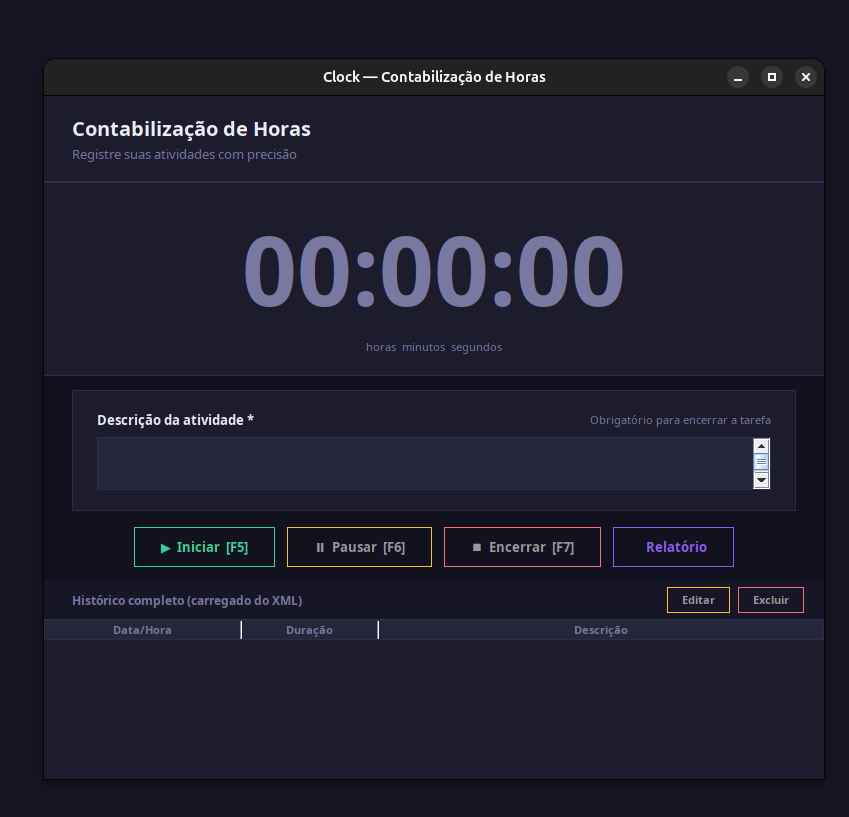
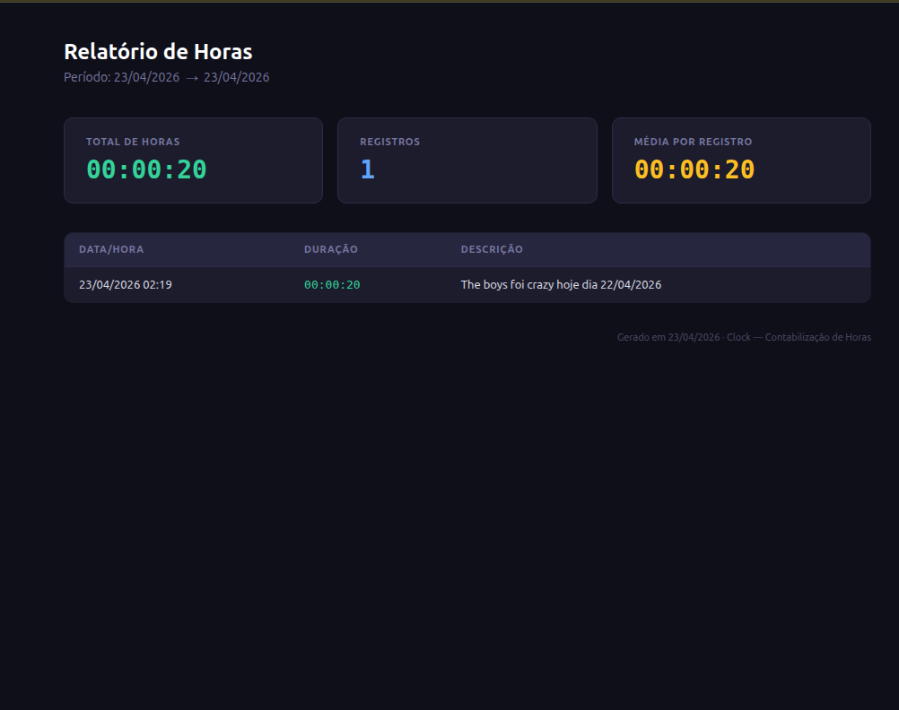

# Clock — Contabilização de Horas

Aplicação desktop em Java/Swing para registrar e contabilizar horas trabalhadas por atividade.

[](https://github.com/Inovation-Hub/Clock/releases/download/version_1.1/clock-1.1.jar)




---

## Pré-requisitos

- **Java 11** ou superior instalado na máquina

Verifique com:
```bash
java -version
```

---

## Executando

Um JAR pronto para uso está disponível na raiz do projeto:

```bash
java -jar clock-1.0.jar
```

---

## Como usar

### Iniciar uma tarefa
Clique em **▶ Iniciar** para começar a contagem de tempo. O contador exibido na tela começa a correr em tempo real.

### Pausar
Clique em **⏸ Pausar** para interromper temporariamente o contador. Clique em **▶ Retomar** para continuar de onde parou.

### Encerrar e salvar
1. Preencha o campo **Descrição da atividade** com o que foi realizado  
2. Clique em **⏹ Encerrar**

> A descrição é obrigatória — o sistema não permite encerrar sem preenchê-la.

O registro é salvo automaticamente no arquivo `clock_records.xml` localizado na pasta do usuário (`~/clock_records.xml`).

### Histórico
A tabela na parte inferior da janela exibe todos os registros salvos, carregados automaticamente ao abrir o aplicativo.

### Gerar Relatório
1. Clique em **📄 Relatório**
2. Informe o período desejado (**De** / **Até**) no formato `dd/MM/yyyy`
3. Clique em **Gerar HTML**

Um arquivo HTML será gerado e aberto automaticamente no navegador padrão com:
- Total de horas no período
- Quantidade de registros
- Média de horas por registro
- Tabela detalhada com todas as atividades

---

## Compilando do código-fonte

```bash
./gradlew jar
```

O JAR gerado estará em `build/libs/clock-1.0-SNAPSHOT.jar`.

---

## Banco de dados

Os registros são persistidos em `~/clock_records.xml` no seguinte formato:

```xml
<records>
  <record>
    <timestamp>23/04/2026 14:30</timestamp>
    <duration>01:23:45</duration>
    <totalSeconds>5025</totalSeconds>
    <description>Desenvolvimento da interface Swing</description>
  </record>
</records>
```
